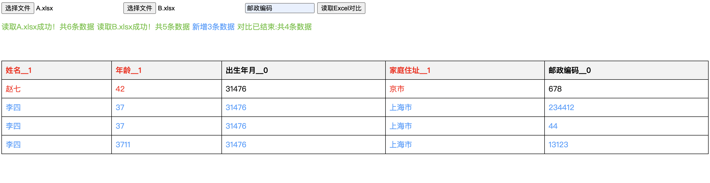

# 小松鼠-js读取Excel对比演示

## 项目截图
 

## 简介
本项目是一个简单的网页应用，使用JavaScript和[xlsx.js](https://github.com/SheetJS/sheetjs)库来读取两个Excel文件，并对比这两个文件中的数据差异。用户可以选择两个Excel文件，指定一个对比字段，程序会高亮显示新增的数据行以及不同数据行中的差异字段。

## 功能特性
- **文件上传**：支持上传两个Excel文件。
- **字段对比**：用户可输入特定字段作为对比基准。
- **结果显示**：以表格形式展示对比结果，包括新增数据和差异字段（红色高亮）。
- **动态表格**：根据对比结果生成表格，并固定表头以便查看。

## 使用方法
1. **下载或克隆本项目** 到本地。
2. 确保`xlsx.full.min.js`文件位于项目根目录或正确调整HTML中的引用路径。
3. 在支持的浏览器中直接打开`index.html`文件。
4. 选择两个要对比的Excel文件。
5. 在输入框中输入用于对比的字段名称。
6. 点击“读取Excel对比”按钮开始对比。
7. 查看结果显示区域和下方生成的对比表格。

## 注意事项
- 确保上传的Excel文件格式兼容（如`.xlsx`, `.xls`等），且结构清晰。
- 对比字段需确保在两个文件的每一条记录中都存在。
- 本示例主要用于教学和简单场景演示，对于大规模数据或复杂对比需求，可能需要进一步优化。

## 技术栈
- HTML/CSS
- JavaScript
- [xlsx.js](https://github.com/SheetJS/sheetjs) - 用于处理Excel文件

## 文件结构
```
├── index.html
├── xlsx.full.min.js // xlsx.js库文件，需自行获取并放置于同一目录
```

## 开发者
- **一库**: 示例代码提供者

## 许可证
本项目采用MIT许可证发布，请自由地学习、修改和分享，但请保留原作者信息。